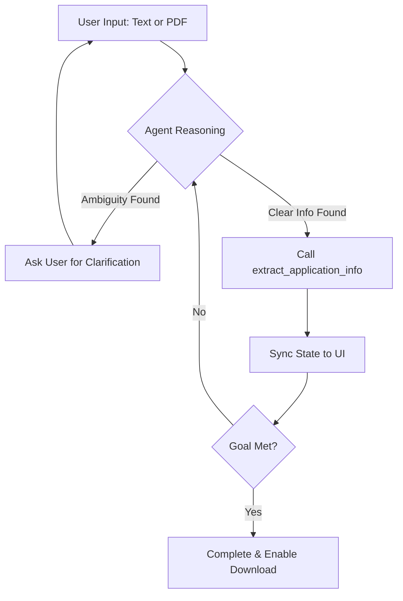

# JobPoint: Goal-Based AI Job Assistant 🤖🎯

JobPoint is a modern, autonomous AI agent designed to help users prepare their job applications. Built with **LangGraph** and **Google Gemini 2.0**, it demonstrates the power of goal-oriented agentic workflows.

## 🚀 Key Features

- **Goal-Driven Autonomy**: The agent is programmed with a specific mission: collect and verify your Name, Email, and Skills. It won't stop until the mission is accomplished!
- **Dual-Pass Resume Parsing**: 
  - **Fast Extraction**: High-speed Regex matching for standard formats.
  - **Deep Reasoning**: Gemini 2.0 analysis for complex or non-standard CV layouts.
- **Interactive Web Interface**: A clean Streamlit UI with real-time status tracking, chat history, and custom avatars.
- **Safe State Sync**: Custom synchronization layer to ensure thread-safe interactions between the AI agent and the Streamlit UI.
- **Result Download**: Once the goal is met, download a structured summary of your application data.

## � Agent Workflow



## �🛠️ Tech Stack

- **Brain**: [Google Gemini 2.0 Flash](https://ai.google.dev/)
- **Orchestration**: [LangGraph](https://langchain-ai.github.io/langgraph/)
- **Frontend**: [Streamlit](https://streamlit.io/)
- **PDF Intelligence**: [PyMuPDF (fitz)](https://pymupdf.readthedocs.io/)
- **Framework**: LangChain

## 📦 Installation

1. **Clone the repository**:
   ```bash
   git clone https://github.com/Thollarkings/jobpoint.git
   cd jobpoint
   ```

2. **Set up a virtual environment**:
   ```bash
   python -m venv venv
   source venv/bin/activate  # On Windows: venv\Scripts\activate
   ```

3. **Install dependencies**:
   ```bash
   pip install -r requirements.txt
   ```

4. **Configure Environment Variables**:
   Create a `.env` file in the root directory:
   ```env
   GOOGLE_API_KEY=your_google_api_key_here
   AI_MODEL=gemini-flash-latest
   ```

## 🎮 How to Run

Launch the Streamlit application:
```bash
streamlit run app.py
```

## 💡 How It Works

This agent uses a **ReAct (Reason + Act)** pattern. Instead of a simple sequence of steps, the agent:
1. Receives user input (text or PDF).
2. Evaluates its current goal progress.
3. Decides which tool to call (`extract_application_info`).
4. Updates the internal state safely using a synchronization marker system.
5. Continues the conversation until all goal criteria (Name, Email, Skills) are fulfilled.

---
Built by [Omotola (Thollarkings)](https://github.com/Thollarkings) as a showcase of Agentic AI.
